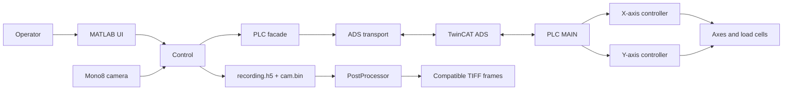

# Aorty biaxial test system

Aorty is a two-axis material-test system built from a MATLAB operator
application and a Beckhoff TwinCAT PLC program. MATLAB prepares and validates
tests, controls recording, and presents machine state. The PLC owns motion,
test sequencing, biaxial synchronization, and protective behavior.

> [!CAUTION]
> The UI **STOP** command is a controlled software halt, not a safety-rated
> emergency stop. Operate the machine only with its approved safety system and
> begin commissioning with conservative force and velocity limits.

## Documentation

| Guide | Use it for |
| --- | --- |
| This README | Installation, first run, normal workflow, and project navigation |
| [General Test guide](aorty/examples/generalTestReadme.md) | Authoring and importing versioned General Test JSON |
| [MATLAB–TwinCAT interface guide](aorty/model/plc/interfaceReadme.md) | ADS symbols, packet layout, recording contracts, and communication tests |
| [TwinCAT PLC guide](<TwinCat/AortyPLC/main program/READMEPLC.md>) | PLC states, synchronization, errors, deployment, and commissioning |

## System architecture



The main responsibilities are deliberately separated:

- MATLAB validates complete commands before writing any start trigger.
- TwinCAT executes the complete pre-test, main-test, and post-test sequence.
- For a biaxial test, TwinCAT starts both axes in one PLC scan and holds them at
  shared phase barriers.
- Camera frames and PLC samples are recorded independently, preserving their
  original timing and sample counts.

## Repository layout

```text
aorty/
  main.m                         MATLAB entry point
  controller/                    Test, acquisition, and recording coordination
  model/                         PLC, camera, settings, and recording models
  model/plc/                     ADS transport and command validation
  view/                          Operator UI
  examples/                      General Test JSON and authoring guide
  tests/                         Offline and interface-contract tests
  .config/appConfig/             UI presets
  .config/hwConfig/              PLC and camera settings
TwinCat/AortyPLC/
  aortyPLC.tsproj                TwinCAT system project
  main program/
    DUTs/                        ADS command, status, and settings structures
    POUs/                        Motion, safety, status, and synchronization logic
    main program.tmc             Generated ADS metadata
    READMEPLC.md                 PLC and commissioning guide
```

## Requirements

- MATLAB with UI support and .NET interoperability.
- The Beckhoff TwinCAT ADS assembly used by
  `aorty/model/plc/PlcAds.m`.
- A TwinCAT/XAE installation for building and deploying the PLC project.
- Image Acquisition Toolbox for recorded tests.
- Computer Vision Toolbox only when annotated TIFF export is required
  (`insertText`).

The checked-in machine configuration uses AMS Net ID
`5.85.113.174.1.1`, ADS port `851`, and interface version `6`. These are
deployment-specific values: review the hardware configuration before
connecting to another machine.

## Setup and first run

1. Build and deploy `TwinCat/AortyPLC/aortyPLC.tsproj`.
2. Confirm that TwinCAT generated the symbols in `main program.tmc`.
3. Review the deployment properties in `aorty/model/Plc.m` (AMS route, ADS
   port, and assembly path), then review
   `aorty/.config/hwConfig/default.json` for camera, force calibration,
   velocity, maximum-force, and relief settings.
4. Start MATLAB from the repository root and run:

   ```matlab
   run("aorty/main.m")
   ```

5. The application opens offline with both `default.json` profiles loaded.
   Use the UI switches to connect the PLC and camera before starting a
   recorded test. Each successful connection automatically applies the
   currently selected hardware profile to that device.

At PLC connection, MATLAB reads `nInterfaceVersion` from both axes. Connection
is rejected if either axis does not report interface version `6`.

## Operator workflow

1. Connect the PLC and verify that the intended axes are powered, idle, and
   free of errors.
2. Connect the camera before any recording-enabled test.
3. Select X, Y, or Both and configure one test tab.
4. Review force, displacement, rate, tolerance, hold-time, post-test, and
   recording options. Test-tab force tolerances are percentages of each
   axis's configured maximum force; MATLAB converts them to newtons before
   writing the PLC command. Imported General Test JSON tolerances remain in
   newtons.
5. Choose an empty output folder when recording is enabled.
6. Start the test and monitor system status, force, displacement, and errors.
7. Inspect `recording.h5` and `cam.bin`; create TIFF output automatically or
   through **Post-process data** when required.

### Test types

| Tab | Main behavior |
| --- | --- |
| **Pre-test** | Optional initial preload followed by repeated force pre-conditioning cycles |
| **Single** | One displacement or force endpoint with an optional OR endpoint |
| **Cyclic** | Constant load/unload endpoints for 1–50 cycles, including mixed control modes |
| **General** | A complete, versioned JSON definition with variable cyclic arrays |
| **Post-test** | Stay, return to a saved/sequence coordinate, return to pre-test final, or release to zero force |

Single and Cyclic displacement endpoints are relative to the coordinate
captured at the synchronized transition into the main test. This origin is
`0 mm`; the live displacement display itself remains the absolute NC position.

For General tests, start with
[`general_test_example.json`](aorty/examples/general_test_example.json) and
the [General Test guide](aorty/examples/generalTestReadme.md).

## Recording outputs

An enabled recording directory initially contains exactly:

```text
cam.bin
recording.h5
```

- `cam.bin` is the unchanged headerless stream of fixed-size Mono8 frames.
- `recording.h5` schema version 1 stores camera rows, independent X/Y PLC
  streams, machine/test settings, status, and recording-integrity metadata.
- Automatic TIFF output is written to `processed_frames`.
- Manual output is written to a unique
  `processed_frames_manual_<timestamp>` directory.

Raw camera acquisition always uses the configured hardware FPS. The TIFF
sampling period filters only post-processed output. See the
[interface and data-contract guide](aorty/model/plc/interfaceReadme.md) for
the HDF5 schema, sample-loss handling, and fixed TIFF layout.

## Offline test validation

`TestValidation` loads one `recording.h5` directly, calculates descriptive
integrity and regulation metrics, and plots the raw X/Y force and position
signals with phase, target, and tolerance overlays. It does not require
`cam.bin` and does not assign pass/fail results.

```matlab
cd aorty
addpath(genpath(pwd))

validation = TestValidation("C:\tests\recording.h5");
metrics = validation.analyze();
fig = validation.plot();

% Or choose a file and perform all three steps at once:
[metrics, fig, validation] = TestValidation.open();
```

## Verification sequence

### 1. Offline suite

The offline suite uses a fake ADS client and does not require a connected PLC
or camera:

```matlab
cd aorty
addpath(genpath(pwd))
results = runtests("tests");
assert(all([results.Passed]))
```

It covers General Test validation, command mapping, ADS packet decoding,
write/trigger ordering, service commands, circular-buffer integrity,
recordings, TIFF compatibility, settings, and source/TMC contract checks.

### 2. Generated-symbol verification

After every TwinCAT DUT or POU change, build the PLC project and run:

```matlab
cd aorty
addpath(genpath(pwd))
verifyGeneratedTmc
```

This verifies interface version `6`, required symbols, array lengths, and
critical status-layout offsets. Never edit `main program.tmc` manually.

### 3. Hardware commissioning

Perform the manual connected checks in the
[PLC commissioning checklist](<TwinCat/AortyPLC/main program/READMEPLC.md#commissioning-checklist>).
They cover sign conventions, power, homing, save/restore, tare, every test
type, synchronized barriers, stop/error propagation, overforce relief,
recording, and post-processing.

## Development rules

- Update the MATLAB command builder, ADS transport, PLC DUTs/POUs, tests, and
  documentation together when the interface changes.
- Increment the interface version when a deployed ADS contract is incompatible.
- Build TwinCAT after DUT changes and commit the regenerated TMC.
- Preserve the 50-entry command/status arrays, the version-6 status layout,
  and the external TIFF contract unless all consumers are migrated together.
- Treat General Test JSON as authoritative; UI presets do not override an
  imported definition.
