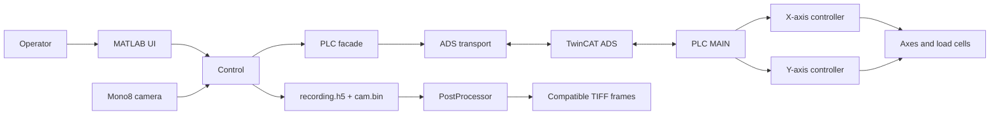

# Aorty biaxial test system

Aorty is a two-axis push/pull test system built specificaly for biomechanical tests.
Main user interface, validation of inputs and test selection is done inside of MATLAB
All realtime control is managed from Beckhoff PLC witch is communicating
with PC runnyng matlab by ADS interface created by Twincat 3.

> [!CAUTION]
> The UI **STOP** command is a controlled software halt, not a safety-rated
> emergency stop. Also it is mandatory for operator to check if ewerithing
> is correctly connected before the machine is turned on and also to validate
> the values that he is imputing before system is used for measurement

## Documentation

| Guide | Use it for |
| --- | --- |
| This README | Installation, first run, test definitions |
| [DevNotes](aorty/ARCHITECTURE.md) | Workflow, and project navigation |
| [MATLAB architecture](aorty/ARCHITECTURE.md) | Component responsibilities and application execution flows |
| [General Test guide](aorty/examples/generalTestReadme.md) | Authoring and importing versioned General Test JSON |
| [MATLAB–TwinCAT interface guide](aorty/model/plc/interfaceReadme.md) | ADS symbols, packet layout, recording contracts, and communication tests |
| [TwinCAT PLC guide](<TwinCat/AortyPLC/main program/READMEPLC.md>) | PLC states, synchronization, errors, deployment, and commissioning |

## System architecture



The main responsibilities are deliberately separated:

- MATLAB validates complete commands before writing any start trigger.
- TwinCAT executes the complete pre-test, main-test, and post-test sequence.
- For a biaxial test, TwinCAT starts both axes in one PLC scan and holds them at
  shared phase barriers.
- Camera frames and PLC samples are recorded independently, preserving their
  original timing and sample counts.

## Repository layout

```text
aorty/
  main.m                         MATLAB entry point
  controller/                    Test, acquisition, and recording coordination
  model/                         PLC, camera, settings, and recording
  model/plc/                     ADS transport and command validation
  view/                          Operator UI
  examples/                      General Test JSON and authoring guide
  tests/                         Offline and interface-contract tests
  .config/appConfig/             UI presets
  .config/hwConfig/              PLC and camera settings
TwinCat/AortyPLC/
  aortyPLC.tsproj                TwinCAT system project
  main program/
    DUTs/                        ADS command, status, and settings structures
    POUs/                        Motion, safety, status, and synchronization logic
    main program.tmc             Generated ADS metadata
    READMEPLC.md                 PLC guide
```

## Requirements

- MATLAB version R2024b with toolboxes: GiGe cam, Image Acquisition, Computer Vision.
- The Beckhoff TwinCAT ADS assembly used by `aorty/model/plc/PlcAds.m`.
- A TwinCAT/XAE installation for building and deploying the PLC project `add later`

The checked-in machine configuration uses AMS Net ID
`5.85.113.174.1.1`, ADS port `851`, and interface version `7`. These are
deployment-specific values

## Setup and first run

1. Build and deploy `TwinCat/AortyPLC/aortyPLC.tsproj`.
2. Review the  properties in `aorty/model/Plc.m` (AMS route, and assembly path),
3. Review `aorty/.config/hwConfig/default.json` for camera, force calibration,
   velocity, maximum-force, and relief settings.
4. Start MATLAB from the repository root and run:

   ```matlab
   run("aorty/main.m")
   ```

5. The application opens with the last successfully applied profiles,
   or `default.json` when no previous selection exists.
   Use the UI switches to connect the PLC and camera before starting a
   recorded test. Each successful connection automatically applies the
   currently selected hardware profile to that device.

## Operator workflow

1. Connect the PLC and verify that the intended axes are powered, idle, and
   free of errors.
2. Connect the camera before any recording-enabled test.
3. Select X, Y, or Both and configure one test tab.
4. Review force, displacement, rate, tolerance, hold-time, post-test, and
   recording options. Test-tab force tolerances are percentages of each
   force endpoint.
5. Start the test. When `testRoot` is configured in
   `aorty/.config/appInfo.json`, the application creates its output folder
   automatically. If no root folder is selected app asks for an empty output folder.
6. Monitor system status, force, displacement, and errors.
7. Inspect `recording.h5` and `cam.bin`; create TIFF output automatically or
   through **Post-process data** when required.

### Test types

| Tab | Main behavior |
| --- | --- |
| **Pre-test** | Optional initial preload followed by repeated force pre-conditioning cycles |
| **Single** | One displacement or force endpoint with an optional OR endpoint or percentage-drop rupture stop |
| **Cyclic** | Constant load/unload endpoints for n cycles, including mixed control modes |
| **General** | A complete, versioned JSON definition with variable cyclic arrays |
| **Post-test** | Stay, return to a saved/sequence coordinate, return to pre-test final, or release to zero force |

Single and Cyclic displacement endpoints are relative to the position
that is recorded on start of each test sequenc

For General tests, start with
[`general_test_example.json`](aorty/examples/general_test_example.json) and the [General Test guide](aorty/examples/generalTestReadme.md).

## Recording outputs

The user-specific `aorty/.config/appInfo.json` may define the recording root:

```json
{
  "hwConfig": "default",
  "appConfig": "default",
  "testRoot": "/home/user/AortyTests"
}
```

Recorded tests are organized as
`YYYY-MM-DD/HH-mm-ss_<test-kind>_<axes>_<preset>`.

An enabled recording directory initially contains exactly:

```text
cam.bin
recording.h5
```

- `cam.bin` is the unchanged headerless stream of fixed-size Mono8 frames.
- `recording.h5` schema version 1 stores camera rows, independent X/Y PLC
  streams, machine/test settings, status, and recording-integrity metadata.
- Automatic TIFF output is written to `processed_frames`.
- Manual output is written to a unique
  `processed_frames_manual_<timestamp>` directory.

Raw camera acquisition always uses the configured hardware FPS. The TIFF
sampling period filters only post-processed output. See the
[interface and data-contract guide](aorty/model/plc/interfaceReadme.md) for
the HDF5 schema, sample-loss handling, and fixed TIFF layout.

Automatic TIFF creation runs only after a completed recording. Manual
post-processing may explicitly recover an aborted or interrupted recording;
the result is labeled `recovered` rather than completed. Output is staged and
published only after every selected frame succeeds, and an existing output
folder is never replaced.

## Offline test validation

`TestValidation` loads one `recording.h5` directly, calculates descriptive
integrity and regulation metrics, and plots the raw X/Y force and position
signals with phase, target, and tolerance overlays. It does not require
`cam.bin` and does not assign pass/fail results.

```matlab
cd aorty
addpath(genpath(pwd))

validation = TestValidation("C:\tests\recording.h5");
metrics = validation.analyze();
fig = validation.plot();

% Or choose a file and perform all three steps at once:
[metrics, fig, validation] = TestValidation.open();
```

## Verification sequence

### 1. Offline suite

The offline suite uses a fake ADS client and does not require a connected PLC
or camera:

```matlab
cd aorty
addpath(genpath(pwd))
results = runtests("tests");
assert(all([results.Passed]))
```

It covers General Test validation, command mapping, ADS packet decoding,
write/trigger ordering, service commands, circular-buffer integrity,
recordings, TIFF compatibility, settings, and source/TMC contract checks.

### 2. Generated-symbol verification

After every TwinCAT DUT or POU change, build the PLC project and run:

```matlab
cd aorty
addpath(genpath(pwd))
verifyGeneratedTmc
```

This verifies interface version `7`, required symbols, array lengths, and
critical status-layout offsets. Never edit `main program.tmc` manually.

### 3. Hardware commissioning

Perform the manual connected checks in the
[PLC commissioning checklist](<TwinCat/AortyPLC/main program/READMEPLC.md#commissioning-checklist>).
They cover sign conventions, power, homing, save/restore, tare, every test
type, synchronized barriers, stop/error propagation, overforce relief,
recording, and post-processing.
