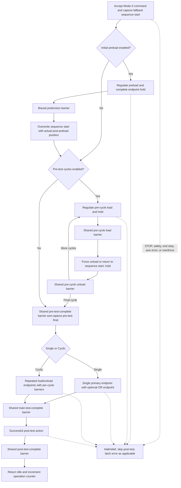
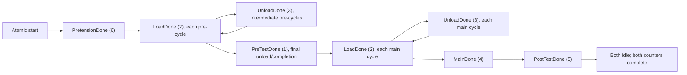

# TwinCAT PLC guide — interface version 6

The Aorty PLC program controls the X and Y axes, publishes acquisition data,
and owns the complete pre-test, main-test, post-test, synchronization, safety,
and overforce sequence. The PLC task period is `10 ms`.

This guide focuses on PLC behavior and commissioning. Related references:

- [Project setup and operator workflow](../../../README.md)
- [General Test JSON](../../../aorty/examples/generalTestReadme.md)
- [ADS, packet, recording, and communication tests](../../../aorty/model/plc/interfaceReadme.md)

> [!CAUTION]
> The MATLAB STOP button is a controlled software halt, not a safety-rated
> emergency stop. Commission only with the approved mechanical/electrical
> safety system ready.

## Project structure

| Area | Responsibility |
| --- | --- |
| `DUTs/ST_MoveCommand.TcDUT` | Public motion and test command |
| `DUTs/ST_SystemStatus.TcDUT` | Public packed status and sample buffers |
| `DUTs/ST_Settings.TcDUT` | Calibration, control, and protection settings |
| `POUs/MAIN.TcPOU` | Public symbols, service routing, axis controllers, and coordinator |
| `POUs/fb_MovementController.TcPOU` | Per-axis motion and test state machine |
| `POUs/fb_BiaxialCoordinator.TcPOU` | Atomic start, barriers, and common abort |
| `POUs/fb_AxisStatusPublisher.TcPOU` | Stable high-level system status |
| `POUs/fb_StatusBuffer.TcPOU` | 50-sample position/force circular buffer and tare |
| `POUs/fb_safety.TcPOU` | End-stop and protective state logic |

MATLAB communicates only through:

```text
MAIN.stMoveCommandX / MAIN.stMoveCommandY
MAIN.stSystemStatusX / MAIN.stSystemStatusY
MAIN.stSettingsX / MAIN.stSettingsY
MAIN.bStartBiaxialTest
```

## Build and symbol rule

`main program.tmc` is generated metadata and must never be hand-edited. After
any DUT or POU change:

1. Open `aortyPLC.tsproj` in a compatible TwinCAT/XAE installation.
2. Resolve the project libraries and build the PLC project.
3. Confirm that the build has no errors.
4. Commit the regenerated `main program.tmc`.
5. Download the matching PLC program.
6. Run MATLAB `verifyGeneratedTmc`.
7. Connect the interface-version-6 MATLAB client and complete the affected
   commissioning checks.

A stale TMC may expose an old ADS layout even when the source DUT is correct.

## Units and structural limits

| Value | Unit/limit |
| --- | --- |
| Position and displacement | mm |
| Motor velocity | mm/s |
| Force | N |
| Hold and duration | s |
| Mode-3 command arrays | Exactly 50 allocated entries |
| Active pre/main cycles | 0–50 in PLC commands; General Cyclic tests use 1–50 |
| Public status packet | 856 bytes |
| Interface version | 6 |

MATLAB owns experiment-value validation. The PLC retains structural bounds,
supported-mode, busy/power, runtime safety, and motion-function-block checks.

## PLC-owned test sequence



Without preload, the position at command acceptance remains the sequence-start
reference. With preload, both axes finish pretension at a shared barrier and
then replace that reference with their actual positions. At the transition
into the main test, each axis captures its actual pre-test-final position; that
coordinate is the `0 mm` origin for Single/Cyclic displacement endpoints.

STOP, safety errors, end stops, axis errors, and overforce abort the sequence
and skip post-test motion.

## `ST_MoveCommand`

### Basic motion and service fields

| Field | Meaning |
| --- | --- |
| `fMoveDistance`, `fMoveVelocity` | Mode 1 relative move |
| `fTargetForce`, `fForceDuration` | Mode 2 force target and accumulated in-tolerance time |
| `nMode` | `1` relative, `2` force/time, `3` complete test |
| `bExecute` | Selected-axis start request |
| `bPower` | Maintained motor-enable request |
| `bHalt`, `bReset`, `bHome`, `bStartTar` | Stop/reset/home/tare requests |
| `bSavePosition` | Capture current coordinate while idle |
| `bRestorePosition`, `fRestoreVelocity` | Restore saved coordinate at a positive speed |

Mode 2 starts its timer only after force is within `fForceTolerance` and the
axis completes its controlled halt. Time is paused, not reset, while correcting
an excursion outside tolerance. Completion requires the configured accumulated
in-tolerance time.

### Force pre-conditioning fields

| Field | Meaning |
| --- | --- |
| `bIncludePreTest` | Include force pre-conditioning |
| `bPreTestOnly` | Run pre-test and post action without a main test |
| `nPreCycleCount` | Repeated load/unload cycles, `0..50` |
| `bPreloadEnabled` | Run one independent initial preload |
| `fPreloadValue` | Initial preload target |
| `fPreCycleLoadValue` | Repeated pre-cycle load target |
| `fPreUnloadValue` | Repeated force-unload target |
| `bPreUnloadToStart` | Return to the post-preload sequence-start coordinate instead of force unload |
| `fPreTestRate` | Positive force-control speed magnitude |
| `fPreTestForceTolerance` | Shared preload/pre-cycle force deadband |
| `fPreloadHoldTime` | Initial preload endpoint hold |
| `fPreCycleHoldTime` | Pre-cycle load/unload endpoint hold |

Initial preload and repeated load are independent values. The PLC has one
pre-test tolerance per axis, so MATLAB requires matching preload and cyclic
tolerances when both phases run on that axis.

### Main Single/Cyclic fields

| Field | Meaning |
| --- | --- |
| `fTestRate` | Positive main-test speed magnitude |
| `fSingleForceTolerance` | Single force-endpoint deadband |
| `fSingleForceHoldTime` | Hold at the Single primary endpoint |
| `fCyclicForceTolerance` | Cyclic force-endpoint deadband |
| `fCyclicForceHoldTime` | Hold at Cyclic load/unload endpoints |
| `nCycleCount` | `0` Single; `1..50` Cyclic |
| `nLoadMode`, `nUnloadMode` | `1` displacement, `2` force |
| `fLoadValues[1..50]`, `fUnloadValues[1..50]` | Per-cycle endpoints |
| `nStop1Mode`, `nStop2Mode` | `0` off, `1` displacement, `2` force |
| `fStop1Value`, `fStop2Value` | Single primary and optional OR endpoint |

Load and unload modes are independent. The UI repeats constant endpoints;
General JSON may provide different values for each cycle.

At a force endpoint, the configured hold completes while the controller
maintains the target inside tolerance. At a displacement endpoint, the hold
begins after motion completion (or immediate recognition of a zero-distance
target), and the powered NC position loop holds position. The Single secondary
OR criterion does not use the primary endpoint hold.

Force-drop and arm-above-force fields are not part of interface version 6.

### Post-test modes

| `nPostTestMode` | General JSON | Action |
| ---: | --- | --- |
| `0` | `stay` | Remain at final position |
| `1` | `saved` | Return to a valid saved coordinate |
| `2` | `sequence_start` | Return to the reference captured after preload |
| `3` | `pretest_final` | Return to the actual position captured after pre-test |
| `4` | `zero_force` | Release toward signed zero force |

Post-test runs only after normal main-test completion. Zero-force release
derives direction from the current force error.

## Biaxial start and synchronization

For X-only or Y-only, MATLAB writes the selected command and pulses its
`bExecute`. For Both, MATLAB writes and validates both complete commands
without either Execute pulse, then pulses `MAIN.bStartBiaxialTest`.

The coordinator accepts Both only when:

- Both axes are ready and powered.
- Both commands use Mode 3.
- Single/Cyclic type and cycle count match.
- Pre-test inclusion, pre-test-only state, pre-cycle count, preload inclusion,
  unload-to-start choice, and phase structure match.
- Post-test modes match.

Per-axis endpoints, rates, tolerances, hold times, and control modes may differ.
Invalid or unavailable prepared commands report error `2010`, and neither axis
moves.



Only barriers present in the selected phase structure are visited. A faster
axis remains in its active status and continues force regulation or powered
position hold until its peer reaches the same point and cycle.

The final pre-test unload uses the pre-test-completion barrier. A Single test
skips the per-cycle main barriers and proceeds to MainDone after its endpoint.

An axis error, safety/protective stop, operator halt, or overforce latches the
coordinator in Aborting. Common aborts stop both axes; local overforce relief
stops only the peer while the affected controller performs relief. Abort
outputs remain asserted until both controllers are idle, preventing deadlock or
restart during unequal stopping times.

Single-axis operations do not enable the coordinator and never wait for an
inactive peer.

## `ST_SystemStatus`

| Field | Meaning |
| --- | --- |
| `nInterfaceVersion` | ADS contract version, currently `6` |
| `nSystemStatus` | Stable high-level state |
| `bWorking` | Axis has an active operation |
| `nOperationCounter` | Increments once after successful completion |
| `bError`, `nErrorCode`, `nAxisErrorID` | PLC and native NC errors |
| `bPowered`, `bStopped`, `bHoming`, `bHomed` | Machine state |
| `bSavedPositionValid` | Saved coordinate is available |
| `fActPosition` | Display position (`50 mm - absolute NC position`) |
| `nBufferHead`, `nSampleCounter` | Circular-buffer position and sequence |
| `fTenzoBuffer[1..50]`, `fPosBuffer[1..50]` | Force and display-position samples |
| `fTenzoTarOffset`, `bTarWorking` | Tare state |

`bHomed` must be true before the PLC accepts tare or motion commands. Completion
requires a changed operation counter, `bWorking=FALSE`, and no error.

### Persistent startup reference

The X and Y axes use incremental encoders. While an axis is referenced and its
NC data is valid, `MAIN` continuously copies its actual coordinate into
`GVL_Persistent`. After a PLC restart, cold reset, or project download:

1. The retained coordinate remains available.
2. When the operator powers the axis, `fb_safety` applies that coordinate with
   `MC_Home` in `MC_Direct` mode.
3. TwinCAT marks the axis referenced without moving the motor.
4. The PLC verifies both `Homed` and the restored coordinate before enabling
   normal commands.

The first deployment, a Reset Origin, missing/corrupt persistent data, or a
failed restore still requires a normal reference-cam home. Requesting a normal
home invalidates the previous retained coordinate until homing succeeds.

TwinCAT ordinarily writes `PERSISTENT` values to `Port_851.bootdata` only on an
orderly runtime shutdown. This project also checkpoints the current references
with `FB_WritePersistentData` after a successful home and after an operator
power-off request. The write starts only after both axes have been stable for
one second. When the app switches off a referenced axis, it waits for a new
successful checkpoint before returning. Before removing controller power,
confirm online that `MAIN.bPersistentPositionSaved=TRUE` and
`MAIN.bPersistentPositionSaveError=FALSE`. If a write fails,
`MAIN.nPersistentPositionSaveErrorID` contains the ADS error.

This mechanism is valid only because the leadscrews keep both axes in exactly
the same physical position while power is removed. Do not use it on an axis
that can move while its encoder is unavailable.

The automatic checkpoint closes the common gap between disabling the motors
and cutting controller power, but it cannot save a position after power has
already disappeared. For power loss at an arbitrary instant, configure a
supported NOVRAM Retain Handler or a UPS/controlled shutdown. If either axis
can move while its incremental encoder is unavailable, use an absolute encoder
or reference again; a saved software coordinate is not safe in that case.

### Software-limit commissioning

The checked-in NC configuration is not yet symmetric: Y has its lower software
limit enabled at the default `0 mm`, X has no enabled lower software limit, and
neither `10000 mm` upper limit is enabled. Do not guess the missing travel
values. After the restart-coordinate check above passes repeatedly, measure the
approved safe working interval for each axis, allow enough distance for the
axis to decelerate before the physical end stop, and then enable both lower and
upper NC software-limit monitoring. Keep the physical end stops active; the
software limits are an additional layer, not a replacement.

| Value | `nSystemStatus` |
| ---: | --- |
| `0` | Idle |
| `1` | Error |
| `2` | Homing |
| `3` | Stopping/protective stop/overforce relief |
| `4` | Taring |
| `5` | Basic move |
| `6` | Constant-force mode |
| `10` | Pretension |
| `11` | Cyclic pre-test |
| `20` | Single main test |
| `21` | Cyclic main test |
| `30` | Post-test |

Status priority is Error, Homing, Stopping, Taring, then the active controller
operation. The exact packet offsets and circular-buffer recovery algorithm are
documented in the
[interface guide](../../../aorty/model/plc/interfaceReadme.md#status-packet).

## `ST_Settings` and overforce behavior

MATLAB writes every settings field for both axes:

- `fTenzoCons`, `fTenzoOffset`
- `fKp`, `fKi`, `fIntegralLimit`, `fForceTolerance`
- `fMaxVelocity`, `fMaxForce`
- `fForceReliefDistance`, `fForceReliefVelocity`

Relief distance and velocity must be finite and positive. The shipped defaults
are `1.0 mm` and `1.0 mm/s`.

When `ABS(force) > fMaxForce`, the PLC halts, determines the most reliable
loading direction, performs one conservative opposite-direction relief move,
and aborts without post-test. If direction is unknown, it performs no blind
move and reports error `2102`.

## Validation and errors

| Code | Meaning |
| ---: | --- |
| `2001` | Unsupported movement mode |
| `2002` | Saved position unavailable |
| `2003` | Unsupported endpoint mode |
| `2005` | Unsupported post action |
| `2006` | Axis power unavailable |
| `2007` | Invalid count/configuration/value |
| `2008` | Conflicting command while busy |
| `2009` | Invalid restore numeric value |
| `2010` | Biaxial commands unavailable or incompatible |
| `2101` | Overforce relief completed; reset required |
| `2102` | Overforce relief direction unknown |
| `2201`, `2203` | Relative or velocity motion-function-block failure |

Safety and homing codes `1001..1017`, plus the native `nAxisErrorID`, are
decoded by MATLAB's `PlcErrorCatalog`.

## General Test and recording boundaries

General Test schema 1 maps validated JSON into `ST_MoveCommand`; the PLC does
not parse JSON. See the [General Test guide](../../../aorty/examples/generalTestReadme.md)
for every field, strict validation rule, and example.

MATLAB records the current PLC status into `recording.h5` and writes raw Mono8
frames to `cam.bin`. The PLC publishes samples and phase status but does not
write files or create TIFF output. Legacy CSV recordings are not supported.
See the [interface guide](../../../aorty/model/plc/interfaceReadme.md#recording-contract)
for the HDF5 schema, loss detection, recovery rules, and TIFF byte layout.

## Commissioning checklist

Use conservative force and velocity settings with the approved safety system
ready:

1. Build TwinCAT, regenerate the TMC, and deploy the matching project.
2. Run `verifyGeneratedTmc`.
3. Connect the updated ADS client and verify interface version `6` on X and Y.
4. Apply settings and confirm maximum force and relief distance/velocity.
5. Check powered, working, stopped, homing, homed, error, saved-position, and
   system-status indications.
6. Save and restore X, Y, and Both.
7. Tare each load cell.
8. Home each axis once and confirm that `bHomed` becomes true.
9. Record both coordinates, restart the PLC, power the axes, and confirm that
   each becomes homed at the same coordinate without motor movement.
10. Switch off both axes in the app, confirm
    `MAIN.bPersistentPositionSaved=TRUE`, then cycle controller power and
    verify both restored coordinates before commissioning software limits.
11. Repeat after a PLC project download, then confirm that Reset Origin clears
    the retained reference and requires normal homing.
12. Jog positive and negative at low speed; confirm position and force signs.
13. Run standalone pre-test with preload, force unload, and unload-to-start.
14. Run displacement and force Single tests with the optional OR endpoint.
15. Run all Cyclic load/unload mode combinations, including mixed modes.
16. Import and run
    [`general_test_example.json`](../../../aorty/examples/general_test_example.json).
17. Exercise every post-test action, including saved-position prerequisites.
18. During a biaxial test, confirm simultaneous start and waiting at each
    configured barrier.
19. Force a controlled one-axis failure and confirm that the peer halts without
    deadlock.
20. Verify STOP, reset, and both end stops.
21. Carefully provoke the approved overforce test and confirm opposite-direction
    relief, latched error, and skipped post-test.
22. Verify raw HDF5/binary recording, automatic TIFF output, and manual
    post-processing.
