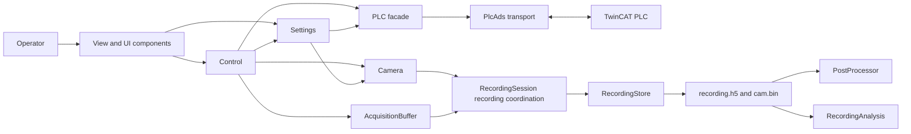
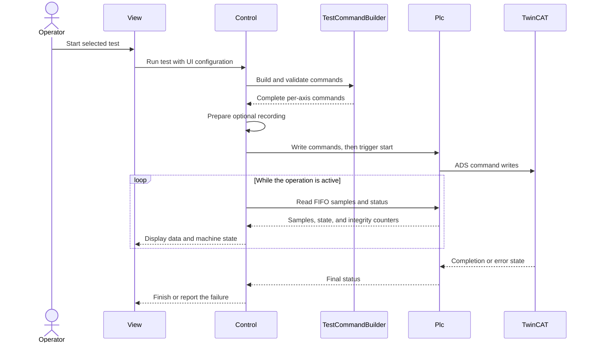
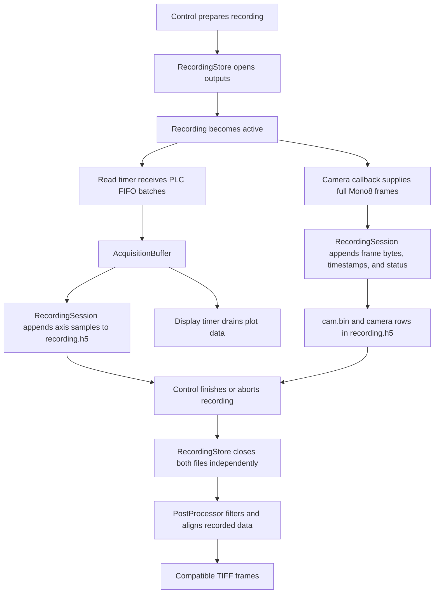
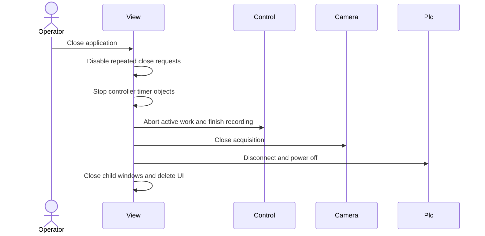

# Aorty MATLAB architecture

This guide describes how the MATLAB application divides responsibility and how
its main workflows move through those components. For PLC internals and the ADS
wire contract, see the
[TwinCAT PLC guide](<../TwinCat/AortyPLC/main program/READMEPLC.md>) and the
[MATLAB-TwinCAT interface guide](hardware/plc/interfaceReadme.md).

## Component responsibilities

- `View` and its components own presentation, operator input, and dialogs.
- `Control` coordinates UI requests, hardware operations, acquisition, tests,
  recording, and application-level error handling.
- `Plc` exposes machine operations while `PlcAds` owns ADS handles, packet
  encoding, and packet decoding.
- `Camera` owns camera acquisition and the latest captured frame.
- `AcquisitionBuffer` holds PLC samples between the read and display timers.
- `RecordingSession` coordinates recording state and delegates file
  persistence to `RecordingStore`.
- `PostProcessor` reads completed recordings and exports compatible TIFF
  frames. `RecordingAnalysis` performs separate offline analysis of HDF5 data.

## Test execution flow

TwinCAT owns the real-time test sequence. MATLAB validates and prepares a
complete command before it sends the start trigger.

## Recording flow

Camera frames and PLC samples retain independent timing and sample counts.
They are synchronized only during post-processing.

## Shutdown flow

Shutdown is best-effort: failure to release one resource must not prevent
attempts to release the remaining resources.

The current shutdown call sequence begins in `View`; moving lifecycle ownership
into `Control` remains a separate review item and is intentionally outside this
documentation-only description.
