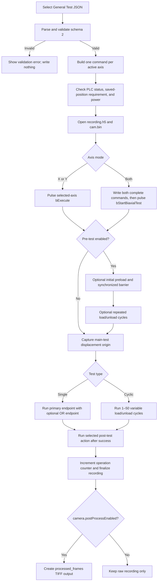

# General Test JSON guide

General Test JSON describes one complete Single or Cyclic test independently
of the UI presets. Use it when endpoints vary by cycle, when a test definition
must be reviewable and reusable, or when the complete experiment should be
stored as one versioned file.

The current format is schema version `2`. The canonical working example is
[`general_test_example.json`](general_test_example.json).

## Import and run

1. Copy `general_test_example.json` to a test-specific filename.
2. Edit the copy and keep every required field.
3. In Aorty, open the **General** tab and select the JSON file.
4. Review the generated summary, active axes, pre-test phases, main-test type,
   post-test action, and camera processing options.
5. Connect the PLC and camera, then start the test.
6. Select an empty recording directory.

The imported JSON is authoritative. Values from the Single, Cyclic, or
Pre-test UI tabs do not override it. Invalid input is rejected before any test
command is written to the PLC.

## Execution sequence



For Both, the axes wait at the PLC synchronization barriers described in the
[PLC guide](<../../TwinCat/AortyPLC/main program/READMEPLC.md#biaxial-start-and-synchronization>).
An error, protective stop, or operator stop aborts the sequence and skips
post-test motion.

## Schema overview

The root object contains exactly these common fields plus the object selected
by `testType`:

| Field | Type | Allowed values | Meaning |
| --- | --- | --- | --- |
| `schemaVersion` | number | `2` | Selects this schema contract |
| `axisMode` | string | `"x"`, `"y"`, `"both"` | Axes that execute the test |
| `testType` | string | `"single"`, `"cyclic"` | Main-test definition to use |
| `preTest` | object | Required | Optional force pre-conditioning configuration |
| `single` | object | Required only for `"single"` | Single endpoint definition |
| `cyclic` | object | Required only for `"cyclic"` | Variable cycle definition |
| `postTest` | string | See [post-test modes](#post-test-modes) | Successful-completion action |
| `camera` | object | Required | Automatic TIFF settings |

Do not include the unselected `single` or `cyclic` object. Unknown root fields
are rejected.

## Axis-valued fields

Every per-axis scalar is an object with both lowercase keys:

```json
{"x": 1.0, "y": 1.0}
```

Both numbers must be finite even for a single-axis test. `axisMode` determines
which values are executed:

| `axisMode` | Executed values |
| --- | --- |
| `"x"` | X values only |
| `"y"` | Y values only |
| `"both"` | Independent X and Y values, synchronized by the PLC |

Rates must be greater than zero. Force tolerances and hold times must be
non-negative. Force and displacement targets may be signed because direction
depends on the installed machine convention.

## Pre-test object

The `preTest` object and its nested `preload` object are always required, even
when pre-conditioning is disabled.

| Field | Type | Unit/range | Meaning |
| --- | --- | --- | --- |
| `enabled` | Boolean | `true`/`false` | Includes or bypasses all pre-test phases |
| `cyclic` | Boolean | `true`/`false` | Enables repeated pre-conditioning cycles |
| `cycles` | integer | 1–50 | Number of repeated cycles when `cyclic` runs |
| `rate` | axis object | mm/s, greater than 0 | Positive motion-speed magnitude |
| `cyclicForceTolerance` | axis object | N, at least 0 | Force deadband for cyclic load/unload endpoints |
| `holdTime` | axis object | s, at least 0 | Accumulated hold at cyclic endpoints |
| `preload` | object | Required | Initial one-time preload phase |
| `load` | axis object | N | Repeated pre-cycle load target |
| `unload` | axis object | N | Repeated pre-cycle unload target |
| `unloadToStart` | Boolean | `true`/`false` | Uses the sequence-start coordinate instead of force unload |

### Preload object

| Field | Type | Unit/range | Meaning |
| --- | --- | --- | --- |
| `enabled` | Boolean | `true`/`false` | Runs one initial preload before cyclic pre-conditioning |
| `value` | axis object | N | Initial preload target |
| `forceTolerance` | axis object | N, at least 0 | Preload force deadband |
| `holdTime` | axis object | s, at least 0 | Accumulated in-tolerance preload hold |

Initial `preload.value` and repeated `preTest.load` are independent targets.
After preload, the PLC overwrites the sequence-start reference with the actual
axis position. `unloadToStart: true` returns to that reference during each
pre-cycle.

The PLC exposes one pre-test force-tolerance field per axis. Therefore, when
`preTest.enabled`, `preTest.preload.enabled`, and `preTest.cyclic` are all
true, these values must match exactly on every active axis:

```text
preTest.preload.forceTolerance.<axis>
    == preTest.cyclicForceTolerance.<axis>
```

For X-only or Y-only tests, a mismatch on the inactive axis is ignored. When
only preload or cyclic pre-conditioning runs, that phase's tolerance is used.

## Single object

A Single test stops when its primary endpoint is reached or, when enabled, its
secondary OR endpoint is reached.

| Field | Type | Allowed value/unit | Meaning |
| --- | --- | --- | --- |
| `primaryMode` | string | `"displacement"` or `"force"` | Required primary endpoint mode |
| `primaryValue` | axis object | mm or N | Primary endpoint |
| `secondaryMode` | string | `"none"`, `"displacement"`, or `"force"` | Optional OR endpoint mode |
| `secondaryValue` | axis object | mm or N | Secondary endpoint; still required when mode is `"none"` |
| `rate` | axis object | mm/s, greater than 0 | Positive speed magnitude |
| `forceTolerance` | axis object | N, at least 0 | Deadband used by force endpoints |
| `holdTime` | axis object | s, at least 0 | Hold applied to the primary endpoint |

Example section:

```json
"single": {
  "primaryMode": "displacement",
  "primaryValue": {"x": 2.5, "y": 2.5},
  "secondaryMode": "force",
  "secondaryValue": {"x": 100.0, "y": 100.0},
  "rate": {"x": 0.5, "y": 0.5},
  "forceTolerance": {"x": 1.0, "y": 1.0},
  "holdTime": {"x": 0.2, "y": 0.2}
}
```

Displacement values are relative to the actual position captured at the
transition into the main test. The captured position is `0 mm`.

## Cyclic object

A Cyclic test supports independent load and unload control modes and a
different endpoint for every cycle.

| Field | Type | Allowed value/unit | Meaning |
| --- | --- | --- | --- |
| `loadMode` | string | `"displacement"` or `"force"` | Load endpoint control mode |
| `unloadMode` | string | `"displacement"` or `"force"` | Unload endpoint control mode |
| `rate` | axis object | mm/s, greater than 0 | Positive speed magnitude |
| `forceTolerance` | axis object | N, at least 0 | Deadband used by force endpoints |
| `holdTime` | axis object | s, at least 0 | Hold applied at load and unload endpoints |
| `loadValues` | axis arrays | mm or N | Per-cycle load endpoints |
| `unloadValues` | axis arrays | mm or N | Per-cycle unload endpoints |

Example section:

```json
"cyclic": {
  "loadMode": "force",
  "unloadMode": "displacement",
  "rate": {"x": 1.0, "y": 1.0},
  "forceTolerance": {"x": 0.1, "y": 0.1},
  "holdTime": {"x": 0.1, "y": 0.1},
  "loadValues": {
    "x": [5.0, 7.5, 10.0],
    "y": [5.0, 7.5, 10.0]
  },
  "unloadValues": {
    "x": [0.0, 0.0, 0.0],
    "y": [0.0, 0.0, 0.0]
  }
}
```

For each active axis:

- Load and unload arrays must contain the same number of elements.
- The common active-axis length is the cycle count and must be 1–50.
- For Both, X and Y must use the same cycle count.
- Every array value must be finite.
- Inactive-axis arrays must still be numeric and may contain at most 50 values,
  but their lengths do not determine the executed cycle count.

The ADS command always allocates 50 elements; MATLAB writes the active values
and pads the remainder with zeroes.

## Post-test modes

Post-test motion runs only after successful completion.

| JSON value | PLC value | Action |
| --- | ---: | --- |
| `"stay"` | `0` | Hold the final position |
| `"saved"` | `1` | Return to a previously saved PLC coordinate |
| `"sequence_start"` | `2` | Return to the start reference captured after preload |
| `"pretest_final"` | `3` | Return to the actual position captured after pre-test |
| `"zero_force"` | `4` | Regulate toward signed zero force |

`"saved"` is rejected before execution unless every active axis reports a
valid saved position.

## Camera object

```json
"camera": {
  "postProcessEnabled": true,
  "samplingPeriod": 0.1,
  "includePrePost": true
}
```

| Field | Type | Meaning |
| --- | --- | --- |
| `postProcessEnabled` | Boolean | Enables automatic TIFF post-processing after recording |
| `samplingPeriod` | finite number ≥ 0 | Minimum interval between exported TIFF frames; `0` exports every eligible frame |
| `includePrePost` | Boolean | Includes pre-test and post-test statuses as well as the main test |

`camera.postProcessEnabled` controls only automatic TIFF creation. Every
recorded test requires a connected camera and captures raw frames at the
configured hardware FPS. When `includePrePost` is false, only statuses `20`
and `21` are eligible for TIFF output; when true, statuses `10`, `11`, `20`,
`21`, and `30` are eligible.

See the [interface and data-contract guide](../hardware/plc/interfaceReadme.md)
for recording and TIFF details.

## Strict validation and legacy fields

The schema is strict: required fields cannot be omitted and unknown fields are
not preserved. The following legacy names are rejected:

- `preLoadValue` (use `preload.value`)
- `preTestHoldTime`
- `forceHoldTime`
- `forceDropPercent`
- `forceDropThreshold`
- `camera.period` (use `camera.samplingPeriod`)
- `camera.enabled` (use `camera.postProcessEnabled`)

Schema-1 definitions are rejected rather than converted automatically.

## Author checklist

Before importing a new file, confirm:

- `schemaVersion` is `2`.
- The selected test object matches `testType`, and the other test object is
  absent.
- Every axis object contains finite `x` and `y` values.
- All rates are positive; tolerances and hold times are non-negative.
- Active Cyclic arrays have matching lengths from 1 to 50.
- Preload and cyclic pre-test tolerances match on active axes when both phases
  run.
- The saved-position post action is used only after saving each active axis.
- `camera.samplingPeriod` is non-negative and reflects TIFF sampling, not raw
  acquisition.

## Related documentation

- [Project overview](../../README.md)
- [MATLAB–TwinCAT interface](../hardware/plc/interfaceReadme.md)
- [TwinCAT PLC sequence](<../../TwinCat/AortyPLC/main program/READMEPLC.md>)
