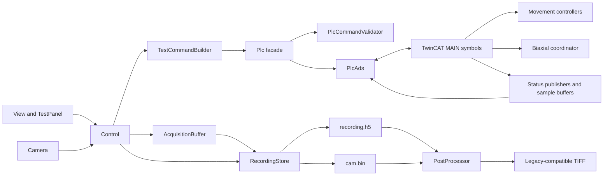
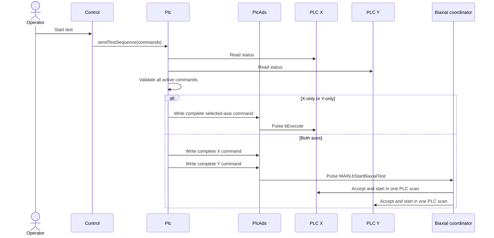
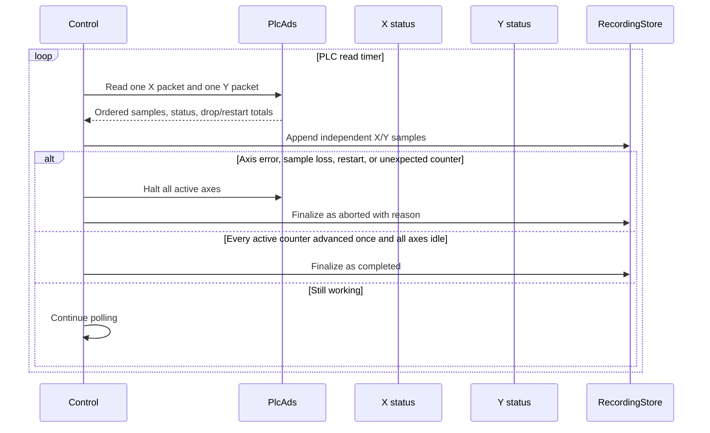

# MATLAB–TwinCAT interface and data contracts

This guide is the integration reference for communication between the Aorty
MATLAB application and the TwinCAT PLC. It also documents the acquisition,
recording, post-processing, and offline communication-test contracts that
depend on PLC status data.

The deployed ADS contract is interface version `6`.

## Component responsibilities



| Component | Responsibility |
| --- | --- |
| `Control` | Starts operations, records starting counters, coordinates acquisition/recording, detects completion or integrity failure, and updates the UI |
| `TestCommandBuilder` | Converts UI presets or General Test definitions into one complete command per active axis |
| `Plc` | Provides application-facing validation and sequencing without owning symbol names |
| `PlcCommandValidator` | Performs pure value, field, saved-position, and biaxial-compatibility checks |
| `PlcAds` | Owns ADS handles, binary status decoding, writes, triggers, circular-buffer tracking, and cleanup |
| TwinCAT `MAIN` | Exposes the public symbols and routes requests to motion, safety, status, and synchronization logic |

## Connection contract

The checked-in deployment defaults in `Plc.m` are:

| Setting | Default |
| --- | --- |
| AMS Net ID | `5.85.113.174.1.1` |
| ADS port | `851` |
| Expected interface | `6` |
| MATLAB PLC read period | `0.25 s` |
| PLC task period | `10 ms` |

The AMS Net ID, ADS port, and ADS assembly path are machine-specific deployment
values, not portable protocol constants. Review them before connecting from a
different engineering computer.

Connection initialization performs this order:

1. Load the configured TwinCAT ADS .NET assembly and connect the client.
2. Create all X and Y status, command, and settings handles.
3. Create the shared `MAIN.bStartBiaxialTest` handle.
4. Read one complete status packet for each axis.
5. Reject either axis if `nInterfaceVersion` is not `6`.
6. Allocate the 50-element command buffers and reset stream counters.

Every handle is registered immediately. If initialization fails partway
through, all successfully created handles are deleted. On disconnect,
`PlcAds` releases handles before `Plc` disconnects and disposes the client.
Expected stale-handle errors during teardown are suppressed.

## Public ADS symbols

The MATLAB client uses four public roots:

| Symbol | Direction | Purpose |
| --- | --- | --- |
| `MAIN.stMoveCommandX/Y` | MATLAB → PLC | Motion, service, and complete test commands |
| `MAIN.stSystemStatusX/Y` | PLC → MATLAB | Packed status and sample-buffer packet |
| `MAIN.stSettingsX/Y` | MATLAB ↔ PLC | Calibration, regulation, and protective limits |
| `MAIN.bStartBiaxialTest` | MATLAB → PLC | Atomic shared start after both commands are prepared |

MATLAB code outside `PlcAds` must not contain raw `MAIN.*` symbol names or
direct `ReadAny`/`WriteAny` calls.

## Command contract

`ST_MoveCommand` selects behavior with `nMode`:

| Mode | Meaning | Primary fields | Start |
| ---: | --- | --- | --- |
| `1` | Relative move | `fMoveDistance`, `fMoveVelocity` | Selected-axis `bExecute` |
| `2` | Constant force for accumulated duration | `fTargetForce`, `fForceDuration` | Selected-axis `bExecute` |
| `3` | Pre-test + Single/Cyclic + post-test sequence | Remaining test fields | Axis `bExecute` or shared biaxial start |

### Service and motion fields

| Fields | Behavior |
| --- | --- |
| `bPower` | Maintained motor-enable request |
| `bHalt`, `bReset`, `bHome`, `bStartTar` | Service requests |
| `bSavePosition` | Captures a PLC-owned return coordinate while idle |
| `bRestorePosition`, `fRestoreVelocity` | Restores the saved coordinate at a positive velocity |

Service operations for Both are validated for both axes before the first write.
TwinCAT clears Home, Reset, Save, Restore, and shared-start requests. The
movement controller consumes Execute and Halt, and the status-buffer controller
clears Tare after completion or rejection.

### Test-sequence fields

| Group | Fields |
| --- | --- |
| Pre-test selection | `bIncludePreTest`, `bPreTestOnly`, `nPreCycleCount`, `bPreloadEnabled`, `bPreUnloadToStart` |
| Pre-test targets | `fPreloadValue`, `fPreCycleLoadValue`, `fPreUnloadValue`, `fPreTestRate` |
| Pre-test endpoint rules | `fPreTestForceTolerance`, `fPreloadHoldTime`, `fPreCycleHoldTime` |
| Main test | `fTestRate`, `nCycleCount`, `nLoadMode`, `nUnloadMode` |
| Cyclic arrays | `fLoadValues[1..50]`, `fUnloadValues[1..50]` |
| Single endpoints | `nStop1Mode`, `fStop1Value`, `nStop2Mode`, `fStop2Value` |
| Main endpoint rules | `fSingleForceTolerance`, `fSingleForceHoldTime`, `fCyclicForceTolerance`, `fCyclicForceHoldTime` |
| Completion action | `nPostTestMode` |

Mode values are `0` off, `1` displacement, and `2` force where an endpoint
mode supports off. The main `nCycleCount` is `0` for Single and `1..50` for
Cyclic. The command arrays always contain exactly 50 `LREAL` values; MATLAB
pads unused elements with zero.

Application preset schema version 2 stores Pre-test, Single-test, and
Cyclic-test tolerances as percentages. Before writing the fields above,
MATLAB converts each percentage with
`tolerance_N = tolerance_percent * fMaxForce / 100` using the selected
hardware profile. General Test schema version 2 remains an absolute-newton
interface and is written without this conversion.

Removed `preLoadValue`, force-drop, and legacy combined-hold fields must not be
sent.

## Command preparation and start ordering

Before any write, `Plc`:

1. Determines the active axes from non-empty X/Y commands.
2. Reads current statuses.
3. Rejects busy/error axes and invalid values.
4. Checks the saved-position requirement.
5. For Both, confirms matching phase structure and post-test mode.
6. Ensures every selected axis is powered.

Single-axis and biaxial starts then differ:



For Both, neither individual `bExecute` is written. If either command is
invalid, MATLAB writes no commands. TwinCAT independently validates the two
prepared commands when the shared request arrives; if either is unavailable or
incompatible, neither axis moves and error `2010` is reported.

The biaxial compatibility contract requires matching test type/cycle count,
pre-test inclusion, pre-test-only state, pre-cycle count, preload inclusion,
unload-to-start choice, phase structure, and post-test mode. Targets, rates,
tolerances, hold times, and endpoint modes may differ by axis.

## Status packet

Each read of `MAIN.stSystemStatusX/Y` requests one complete 856-byte packet.
Using one packet prevents fields from different PLC scans being combined.

| Byte offset | Size | PLC field | MATLAB name |
| ---: | ---: | --- | --- |
| `0` | 400 | `fPosBuffer[1..50]` | `positionBuffer` |
| `400` | 400 | `fTenzoBuffer[1..50]` | `forceBuffer` |
| `800` | 2 | `nBufferHead` | `bufferHead` |
| `804` | 4 | `nSampleCounter` | `sampleCounter` |
| `808` | 4 | `nOperationCounter` | `operationCounter` |
| `812` | 4 | `nInterfaceVersion` | `interfaceVersion` |
| `816` | 8 | `fTenzoTarOffset` | `tareOffset` |
| `824` | 8 | `fActPosition` | `position` |
| `832` | 1 | `bWorking` | `working` |
| `833` | 1 | `bTarWorking` | `tareWorking` |
| `834` | 1 | `bError` | `error` |
| `836` | 4 | `nErrorCode` | `errorCode` |
| `840` | 4 | `nAxisErrorID` | `axisErrorID` |
| `844` | 1 | `bPowered` | `powered` |
| `845` | 1 | `bHoming` | `homing` |
| `846` | 1 | `bHomed` | `homed` |
| `847` | 1 | `bStopped` | `stopped` |
| `848` | 1 | `bSavedPositionValid` | `savedPositionValid` |
| `850` | 2 | `nSystemStatus` | `systemStatus` |

Unlisted bytes are TwinCAT structure padding. The layout comes from the
generated TMC and is enforced by offline contract tests. Any incompatible DUT
layout change requires a new interface version and matching MATLAB decoder.

The stable `nSystemStatus` values are:

| Value | State |
| ---: | --- |
| `0` | Idle |
| `1` | Error |
| `2` | Homing |
| `3` | Stopping/protective stop/overforce relief |
| `4` | Taring |
| `5` | Basic move |
| `6` | Constant-force mode |
| `10` | Pretension |
| `11` | Cyclic pre-test |
| `20` | Single main test |
| `21` | Cyclic main test |
| `30` | Post-test |

Any other system-status value, invalid buffer head, short packet, or interface
version mismatch is rejected.

## Circular-buffer streaming

Each axis owns an independent 50-sample position/force circular buffer and
wrapping `UDINT` sample counter.

1. The first packet after connection establishes the counter baseline and
   returns no samples.
2. Later reads calculate the unsigned counter delta, including valid
   wraparound at `2^32`.
3. `nBufferHead` identifies the latest completely written sample.
4. MATLAB reconstructs samples in chronological order from one packet.
5. If more than 50 samples arrived, the newest 50 are returned and the excess
   is added to that axis's dropped-sample count.
6. A backward jump away from normal `UDINT` wrap is recorded as a PLC restart;
   that packet returns no samples and establishes a new baseline.

Disconnecting or explicitly resetting streaming state clears baselines,
dropped-sample counts, restart counts, unread samples, and UI plot histories.
During a recorded operation, any new dropped sample or restart aborts the test
so incomplete acquisition cannot be labeled completed.

## Completion, errors, and aborts

`Control` records each active axis's starting `nOperationCounter`. Successful
completion requires:

```text
nOperationCounter == start + 1 modulo 2^32
and bWorking == FALSE
and bError == FALSE
```

For Both, all conditions must be true on both axes. A counter value that is
neither unchanged nor the expected next value is treated as an integrity
failure.



An error on one active axis causes MATLAB to request Halt on every active axis.
The PLC biaxial coordinator also propagates common aborts and holds its abort
state until both controllers are idle. Post-test motion runs only after normal
completion.

Application error codes and commissioning behavior are listed in the
[PLC guide](<../../../TwinCat/AortyPLC/main program/READMEPLC.md#validation-and-errors>).

## Settings contract

MATLAB reads and writes every field of `ST_Settings` for each axis:

| Group | Fields |
| --- | --- |
| Load-cell calibration | `fTenzoCons`, `fTenzoOffset` |
| PI force controller | `fKp`, `fKi`, `fIntegralLimit`, `fForceTolerance` |
| Limits | `fMaxVelocity`, `fMaxForce` |
| Overforce relief | `fForceReliefDistance`, `fForceReliefVelocity` |

All values must be finite. The tenzo constant must be non-zero; tolerances and
integral limit must be non-negative; maximum velocity, maximum force, relief
distance, and relief velocity must be positive. Unknown or missing settings
fields are rejected.

## Recording contract

Every enabled recording directory initially contains exactly:

```text
cam.bin
recording.h5
```

Existing files are never overwritten.

### `cam.bin`

`cam.bin` is an unchanged, headerless sequence of fixed-size Mono8 frames. For
image width `W` and height `H`, frame `n` begins at:

```text
(n - 1) * W * H
```

Each frame contains `W * H` bytes. Raw acquisition uses the configured
hardware FPS and is not reduced by TIFF sampling.

Before the PLC test trigger, MATLAB prepares both recording files, discards
camera frames queued during file creation, and records a 0.5-second Idle
warm-up. The warm-up lets the independent camera and PLC streams establish
overlapping coverage before test motion begins.

### `recording.h5` schema version 1

| HDF5 location | Shape/columns | Purpose |
| --- | --- | --- |
| `/metadata/schema_version` | scalar `uint32` | Recording schema, currently `1` |
| `/camera/records` | `frame_index, elapsed_seconds, system_status` | One row per recorded camera frame |
| `/plc/X/samples` | `elapsed_seconds, force, untared_force, position` | Independent X samples |
| `/plc/Y/samples` | `elapsed_seconds, force, untared_force, position` | Independent Y samples |
| `/settings/plc/X`, `/settings/plc/Y` | attributes | Runtime axis settings |
| `/settings/test` | attributes | Test kind, axes, and post-processing choices |
| `/settings/test/X`, `/settings/test/Y` | attributes | Executed per-axis commands |
| `/camera` | attributes | Runtime dimensions and camera settings |

Metadata attributes include start/end time, application and PLC interface
versions, PLC/status intervals, final status/reason, record counts,
per-axis dropped-sample counts, sample-loss state, and PLC-restart state.
Final status is `completed` or `aborted`; controlled aborts retain their
reason.

Camera and PLC times are elapsed seconds from the dated local recording start.
The X and Y streams may have different lengths. The camera `system_status` is
the latest valid status from the first active axis (X for Both) or Idle when no
test axis is active.

Legacy CSV recordings are rejected. If an interrupted but readable recording
has extra timestamp rows or trailing/incomplete binary bytes, post-processing
warns and uses every complete frame/timestamp pair. A recording with no camera
frames produces no TIFF directory.

## TIFF post-processing contract

Automatic processing writes `processed_frames`. Manual processing writes a
unique `processed_frames_manual_<timestamp>` directory.

Phase eligibility is evaluated before interval sampling:

- Main only: statuses `20` and `21`.
- Include pre/post: statuses `10`, `11`, `20`, `21`, and `30`.
- Idle status `0` is never exported, but its frames remain in the raw recording.
- Frames outside the common X/Y PLC timestamp range are skipped with a warning;
  PLC edge values are never extrapolated onto those frames.
- Sampling restarts at a status transition or after an ineligible gap.
- Sampling period `0` exports every eligible frame.

Every generated file is named `processed_frame_%04d.tiff` and preserves this
external integration contract:

| Property | Required value |
| --- | --- |
| Byte order/type | Classic little-endian TIFF (`II`) |
| IFD | Starts at byte `8`, exactly 13 entries, no next IFD |
| Header | Exactly 1024 bytes |
| Description | Metadata area beginning at byte `256`, with fixed key order and formatting |
| Pixel offset | Byte `1024` |
| Pixels | Uncompressed, single-channel `uint8`, row-by-row |
| Dimensions | Must fit unsigned 16-bit TIFF width/height fields |

MATLAB `imwrite` is not a compatible replacement because it may change
compression, channels, IFD placement, or metadata layout.

## Communication and contract tests

The offline suite uses `FakeAdsClient` and does not require TwinCAT, axes, or a
camera.

| Test | Contract covered |
| --- | --- |
| `testPlcAds.m` | Version checks, packet decoding, FIFO ordering/wrap/drop detection, command writes, 50-value padding, start ordering, services, settings, completion, and error behavior |
| `testPlcAdsTransport.m` | Handle ownership/cleanup, partial initialization, disconnect behavior, stream reset, and PLC-restart detection |
| `testPlcContract.m` | MATLAB/DUT symbol agreement, array bounds, critical PLC types and logic markers, TMC size/offsets, and generated-symbol verification |
| `testRecordingLifecycle.m` | HDF5 structure, lifecycle, settings/commands, counters, loss/restart metadata, and recording abort behavior |
| `testPostProcessor.m` | Status filtering, sampling restart, interrupted data, TIFF binary layout, and legacy rejection |
| `testGeneralTestDefinition.m` | Strict JSON schema, boundary values, tolerance rules, and command mapping |
| `testUiPlcContract.m` | UI/controller use of the current version-6 fields and removal of legacy controls |
| `testRefactoringComponents.m` | Preset/General command builders, acquisition buffering, plot references, and strict hardware settings |

Run all offline checks:

```matlab
cd aorty
addpath(genpath(pwd))
results = runtests("tests");
assert(all([results.Passed]))
```

After a TwinCAT build, verify the generated public contract:

```matlab
cd aorty
addpath(genpath(pwd))
verifyGeneratedTmc
```

For connected verification, follow the
[PLC commissioning checklist](<../../../TwinCat/AortyPLC/main program/READMEPLC.md#commissioning-checklist>).
Connected checks are intentionally manual because they move real hardware and
must use the approved safety system.

## Interface-change checklist

When changing a DUT, symbol, enum, or wire layout:

1. Update PLC DUTs and POUs.
2. Update `PlcAds`, command validation/building, and error decoding.
3. Increment the interface version for an incompatible deployed contract.
4. Build TwinCAT and regenerate `main program.tmc`; never edit it manually.
5. Update fake-ADS, source-contract, packet-layout, recording, and UI tests.
6. Update this guide, the PLC guide, and the General Test guide when mappings
   change.
7. Run the full offline suite and `verifyGeneratedTmc`.

## Related documentation

- [Project overview](../../../README.md)
- [General Test JSON](../../examples/generalTestReadme.md)
- [TwinCAT PLC](<../../../TwinCat/AortyPLC/main program/READMEPLC.md>)
